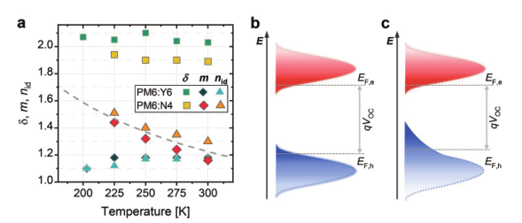
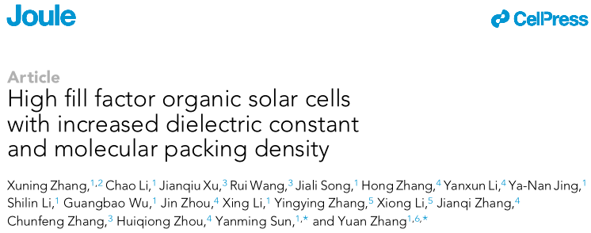
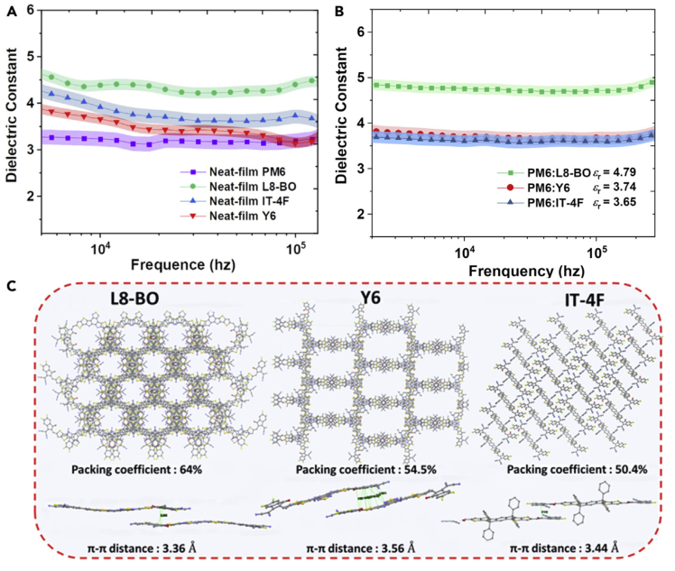

# Week 01

## 1. 能量无序解释低电压损失

**期刊：AEM**

**作者：Dieter Neher （德国 波茨坦大学）**

**发表时间：2022.02.03**

**链接：** https://onlinelibrary.wiley.com/doi/full/10.1002/aenm.202103422

**总结：**

作者通过对比Y6分子和N4，发现Y6中的双分子复合系数更大，这与器件更小的电压损失不符。通过形貌分析、电学分析发现，在N4体系中，由于给受体比较强的混合，使DOS的分布更无序，这种能量无序才是更高的能量损失的原因。

**启发：**

这篇文章很深的物理分析，值得深入学习（***本周不再学习，加入后续专题计划***）。 以后要把无序能量分析加入器件分析中。

## 2. 介电常数与复合分析

**期刊：Joule**

**作者：张渊 （北航化学院）**

**发表时间：2022.02.09**

**链接：** https://www.sciencedirect.com/science/article/pii/S2542435122000381

**总结：**

作者揭示了OSC材料的介电性质对器件FF的影响。在PM6:L8-BO的器件中，受体的堆积密度增加促进了介电常数增加，同时保持薄膜形貌保持良好的相分离尺度可以在有机太阳光伏器件中实现与钙钛矿太阳能电池相当的双分子复合率，从而获得82%的器件填充因子。

**亮点：**

- 构建了MPD与介电常数之间的关系，解释高填充因子
- 计算了双分子复合系数

